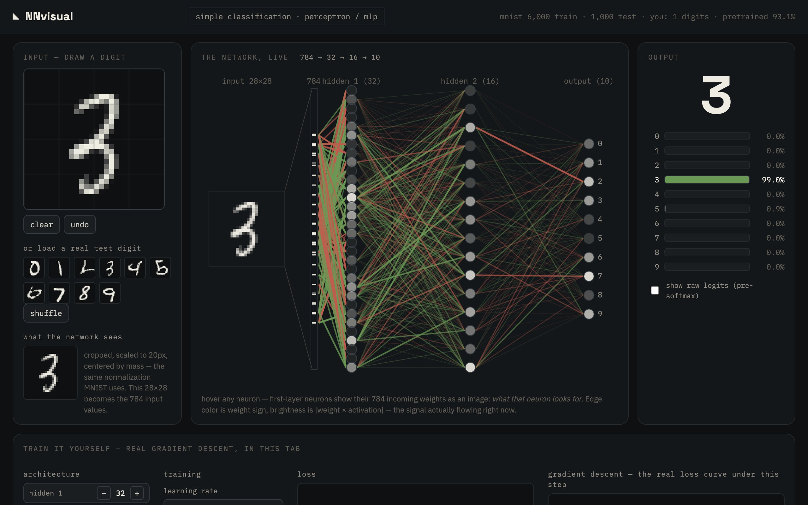

# NNvisual

Pick a neural network — **transformer**, **CNN**, **MLP**, or **diffusion** — and
watch the real thing run in your browser. Nothing on any page is a canned
animation: every activation, attention weight, gradient, and denoising step is
computed live by models running in vanilla JavaScript.

**Live:** [j4den.com/nnvisual](https://j4den.com/nnvisual/)



## The four demos

- **Simple classification — `mlp.html`.** Draw a digit; a pretrained
  784-32-16-10 perceptron classifies it live. The 28×28 unrolls into its 784
  input values, activations light the layer columns, and hovering a first-layer
  neuron shows its weights as an image — what it looks for. Then train it
  yourself: real minibatch SGD on 6,000 MNIST images in-page, an editable
  architecture, a measured gradient-descent loss curve along the actual
  gradient, a backprop replay of real gradients — or teach it *your*
  handwriting from a dataset you draw yourself.
- **Image detection — `cnn.html`.** A 97%-test-accuracy convnet, stage by
  stage: learned kernels, live feature maps, pooling, flatten, vote. Scan mode
  runs the convolution in slow motion with the patch × kernel arithmetic; a
  kernel playground lets you convolve your drawing with hand-edited kernels.
- **Language models — `transformer.html`.** A 115k-parameter char-GPT trained
  on Shakespeare generates text token by token. Attention arcs and the causal
  QK^T triangle are clickable down to single scores; the 65 character
  embeddings are PCA-projected live (vowels, capitals, digits visibly
  cluster), and a cosine-similarity explorer draws the true 64-d angle
  between any two characters.
- **Image generation — `diffusion.html`.** Slide t to noise a real digit by
  the exact schedule math, then watch class-conditional DDIM grow a new digit
  out of pure noise — the model's clean-image belief and predicted noise at
  every step, with classifier-free guidance you control. The latent tab
  encodes 1,000 digits through a 2-D autoencoder bottleneck into a plane you
  can drag to decode.

## How it's built

- **Zero runtime dependencies.** `public/js/engine/` is a small Float32Array
  engine: dense nets with backward, conv/pool, a transformer forward with full
  capture, and a DDIM sampler. No frameworks, no build step. The only dev
  dependency is ESLint.
- **Models are trained offline, reproducibly** by the numpy scripts in
  `training/` (each gradient-checks itself before running), then shipped as
  fp16 binaries in `public/data/weights/` with stratified MNIST subsets.
- **CI proves the site tells the truth.** `tests/` holds 58 tests: numerical
  gradient checks, a conv reference implementation, transformer causality —
  and golden-fixture gates where the JS engine must reproduce the numpy
  trainers' outputs, clear accuracy thresholds on held-out digits, and
  generate diffusion samples the shipped CNN recognizes.

```sh
npm run serve   # http://localhost:4173 — any static server works
npm test        # node --test
npm run lint
```

## Repo layout

```
public/           the deployable site (static, self-contained)
  js/engine/      the math: tensor ops, mlp, conv, transformer, diffusion
  js/pages/       one controller per demo
  js/ui/          draw box, heatmaps, bars, charts
  data/           mnist subsets + fp16 model weights
training/         numpy trainers + dataset packer (python3 + numpy only)
tests/            engine tests + golden gates pinning JS to the trainers
docs/PLAN.md      the build plan and per-demo visualization specs
```

## Deploying

`public/` is copied into the j4den.com site repo at `frontend/public/nnvisual/`
(`scripts/sync-to-site.sh`), where Cloudflare Pages serves it. Every page ships
a strict same-origin CSP meta tag and works standalone.

Work lands through pull requests with required CI — see
[CONTRIBUTING.md](CONTRIBUTING.md) and [SECURITY.md](SECURITY.md).

## License

[MIT](LICENSE)
